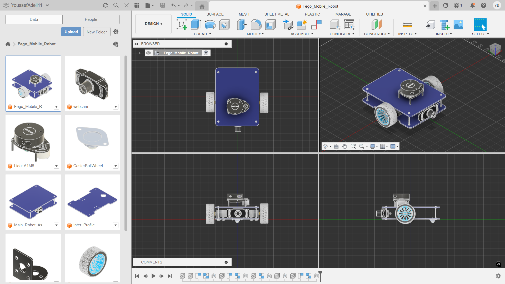

# 🤖 Fego Mobile Robot CAD

Welcome to the open-source CAD repository for the **Fego Mobile Robot**! This is a 2-Wheel Drive (2WD) differential mobile robot designed from the bottom-up using **`Fusion 360`**. 

This repository contains all the mechanical CAD files, manufacturing 2D profiles, and 3D meshes required to build the physical robot or simulate it in ROS 2 (RViz/Gazebo).

## 🗂️ Folder Structure

The hardware files in this repository are organized to help you find exactly what you need, whether you want to 3D print the whole robot, cut the chassis, or just borrow a sensor model for your own project.

### **`1_Full_Assembly/`**
Contains the complete, assembled robot model.
* `.step` - Universal 3D CAD file (Open in SolidWorks, Inventor, Onshape, etc.)
* `.f3d` - Native Fusion 360 archive with the complete design timeline and linked components.

### **`2_Components/`**
Individual `.step` files for standard third-party hardware and custom parts. You can easily drag and drop these into your own custom robot designs!
* Inter Profile
* Outer Profile
* Bracket 25mm
* RPLidar A1M8
* JGA25-370 TT Geared Motors
* 65mm Robot Wheels
* Caster Ball Wheel
* Webcam Module

### **`3_Manufacture_Files/`**
2D profiles and files for fabricating the custom parts.
* `.dxf` - Files for laser cutting or CNC routing the acrylic top and bottom plates.
* `.stl` - Files for 3D printing the 25mm Brackets.

### **`4_Meshes/`**
Optimized 3D meshes specifically exported for ROS 2 simulation (RViz/Gazebo).
* `lidar.stl`
* `base_link.stl`
* `camera.stl`
* `caster.stl`
* `wheel.stl`

### **`5_Renders/`**
High-quality, photorealistic images of the final assembly for reference and documentation.

---

## 🛠️ Main Components List

To build the electrical and sensor stack of this robot, the following major components are used:

* **Controller:** Arduino Mega (or Uno) & H-Bridge Motor Driver
* **Actuators:** 2x JGA25-370 TT Geared DC Motors with Encoders
* **Wheels:** 2x 65mm Rubber Tires with Plastic Rims, 1x Front Caster Ball Wheel
* **Vision / LiDAR:** RPLIDAR A1M8 & Forward-facing USB Webcam
* **Chassis:** 2x Custom Acrylic Plates (Top and Bottom)

---

## 🔩 Hardware & Fasteners Bill of Materials (BOM)

Below is the required hardware matrix for assembling the mechanical chassis and mounting the electronics.

| Subsystem / Assembly | Screws Required | Nuts Required | Spacers / Extras |
| :--- | :--- | :--- | :--- |
| **Main Chassis (Plates 1 & 2)** | 4x M3x50 | 12x M3 | - |
| **Motor Brackets** | 8x M4 | 8x M4 | - |
| **TT Motors** | 4x M3 | - | - |
| **Caster Wheel** | 2x M3 | 2x M3 | - |
| **Arduino & H-Bridge** | 8x M3 | 8x M3 | 8x M3 Spacers |

---

## 🚀 Getting Started

**To build the physical robot:**
1. Laser cut the top and bottom plates using the `.dxf` files in `3_Manufacture_Files/`.
2. 3D print the 25mm brackets.
3. Gather the components listed in the BOM.
4. Use the `1_Full_Assembly/` `.step` or `.f3d` file as a visual guide for putting it all together.

**To simulate in ROS 2:**
1. Copy the contents of `4_Meshes/` into the `meshes` folder of your ROS 2 description package.
2. Link them in your URDF/Xacro file. 

## 🇪🇬 Local Sourcing (Egyptian Market)
If you are building this robot in Egypt, you can easily source the main mechanical components from local electronics suppliers:

* **[Metal Caster Wheel](https://makerselectronics.com/product/metal-caster-wheel-for-robot/)** 
  * *Makers Electronics*
* **[Main Chassis / 2WD Platform](https://makerselectronics.com/product/robot-platform-2wd-square-shape/)** 
  * *Makers Electronics* (Note: This is a great alternative if you don't want to laser cut the custom acrylic plates).
* **[65mm Wheel & TT Motor Kit](https://electra.store/products/robot-wheel-65mm-with-gear-motor)** 
  * *Electra Store* (Includes the 65mm rubber wheels, TT gear motors, and the necessary motor mounting brackets).