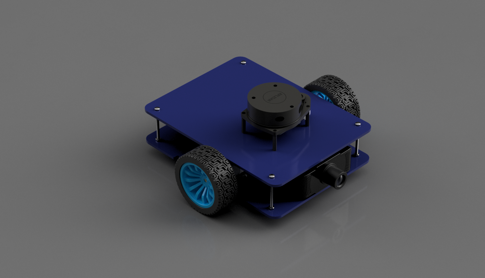
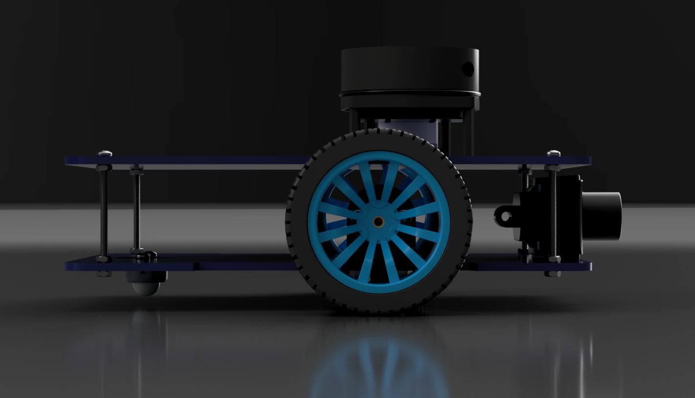
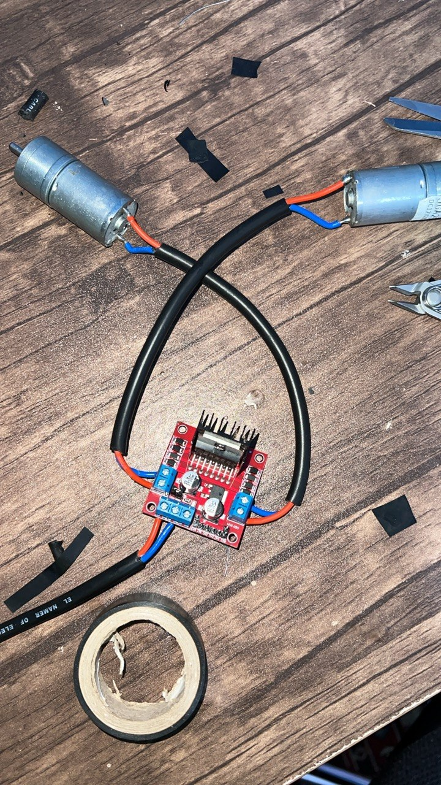
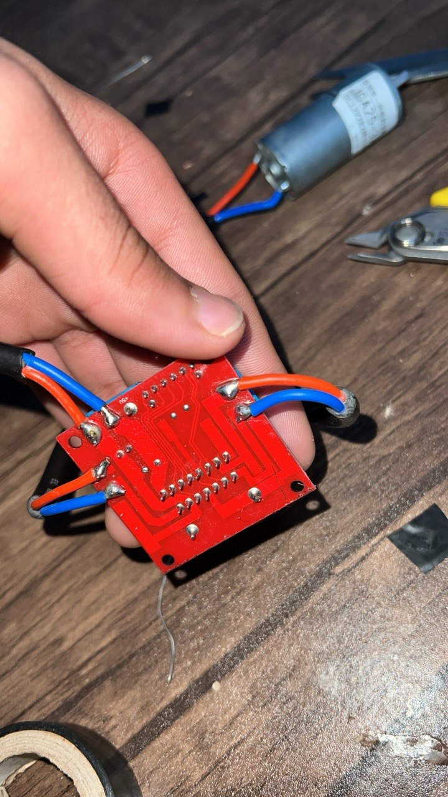
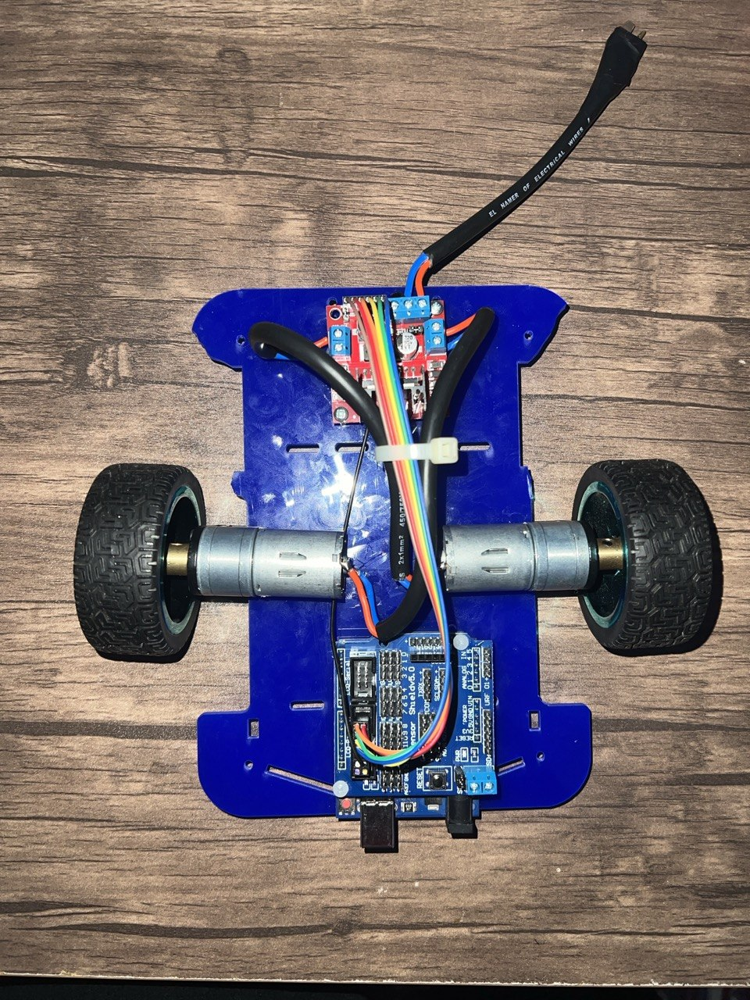
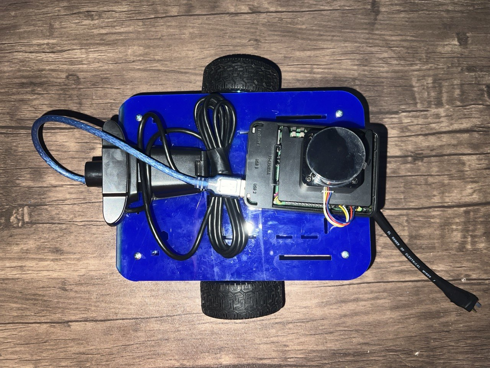
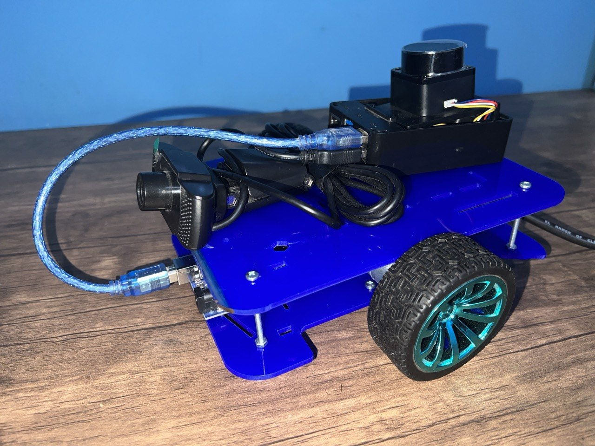
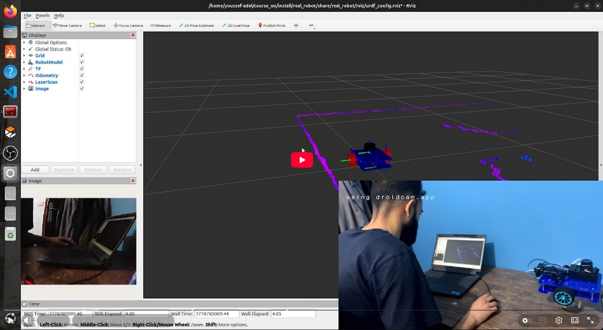

# Fego Mobile Robot

**Author:** Youssef Adel Wahba Boutros

## Project Overview
The Fego Robot is a custom-built differential drive mobile platform. Powered by a Raspberry Pi 5 and utilizing `ros2_control`, this project bridges the gap between hardware assembly and advanced ROS 2 robotics software. This documentation covers the 3D design, physical hardware build, software visualization, and real-world testing.

---

## 1. 3D CAD Design (Fusion 360)
The chassis and component placements were initially modeled in Autodesk Fusion 360 to ensure optimal weight distribution and sensor mounting.

  

  
  

---

## 2. Hardware Assembly & Real Robot
The physical build incorporates DC motors, an L298N motor driver, LiDAR, and a camera module. 

### Electronics & Wiring

  
  

### Chassis & Assembly Layout

  
  

### Final Assembled Platform

  

---

## 3. Software & Visualization
The robot's URDF, sensor data, and odometry are visualized in real-time using RViz.

  

---

## 4. Real-World Testing
Watch the Fego mobile base navigating and demonstrating its differential drive system and `ros2_control` integration.

  <em>Please hit the image to see the YouTube video!</em> 

  

