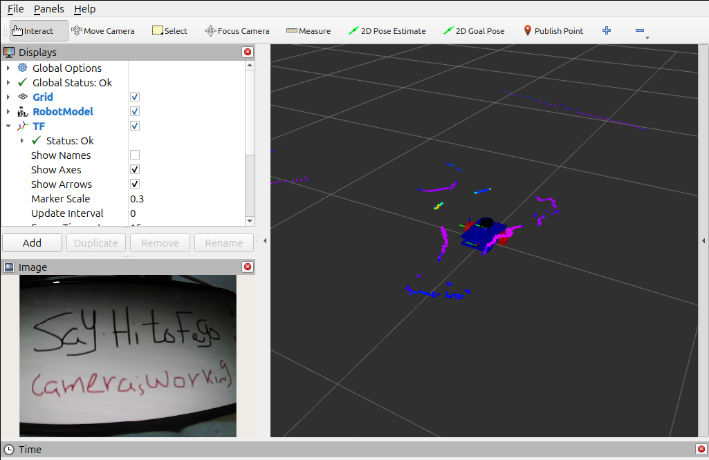
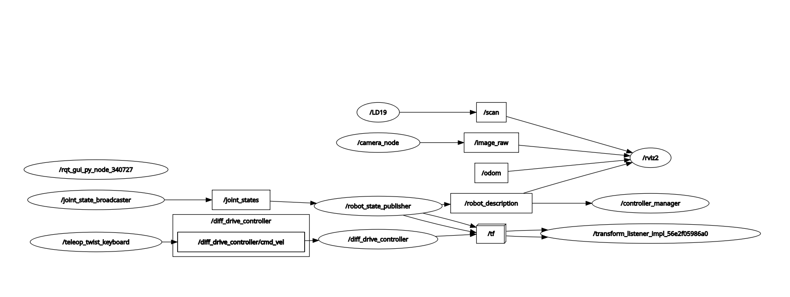
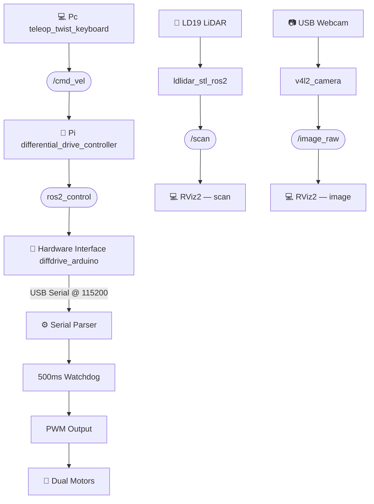

# Fego Mobile Robot Software

A ROS 2 Jazzy differential-drive robot with Arduino-based motor control, LiDAR, and a USB camera. Three workspaces cover the full stack — from microcontroller firmware to remote visualization.


---

## 📁 Repository Structure

```
Fego/
├── firmware/       # Arduino sketch — low-level PWM motor driver
├── rpi_ws/         # Raspberry Pi workspace — core ROS 2 stack
├── laptop_ws/      # Laptop workspace — visualization & teleoperation
└── README.md       # This file
```
---

## 🖼️ System Visualization

### 💻 RViz2 Visualization

<p align="center">

</p>
<p align="center">
Figure 1: Rviz2 showing the Fego Robot URDF, LaserScan data, and Camera feed.
</p>


### 🔄 Topic Network Overview
The system relies on a distributed node network. High-level commands flow from the Laptop to the Pi 5, while sensor data and hardware states flow back. 

<p align="center">

</p>

* **Actuations:** `/cmd_vel` (Laptop → Pi 5) and `/cmd_vel_pwm` (Pi 5 → Arduino).
* **Sensors:** `/scan` (LiDAR) and `/image_raw` (Camera).
* **Transformations:** `/tf` and `/odom` for localization.

---

## 🏗️ System Architecture



> **Note:** Here is the [PDF for the system flowchart](/Software/index/Flowchart.pdf) if you want more information on how the hardware and ROS topics interact.
---

## 📦 Workspaces

### 📡 `firmware/` — Arduino Motor Driver
The `firmware.ino` sketch runs on the Arduino and acts as the direct hardware driver for the differential drive system. It listens for serial commands from the ROS 2 `diffdrive_arduino` hardware interface and outputs the corresponding PWM signals to the motor drivers.

- **Protocol:** `m <left_pwm> <right_pwm>\r` at 115200 baud
- **Safety:** 500ms watchdog — automatically halts motors if the Pi stops sending data

**Pin Configuration:**

| Side | Pin | Function |
| :--- | :---: | :--- |
| Left motor | 5 | PWM (speed) |
| | 6 | IN1 (direction) |
| | 7 | IN2 (direction) |
| Right motor | 10 | PWM (speed) |
| | 8 | IN3 (direction) |
| | 9 | IN4 (direction) |

**Upload:** Open `firmware.ino` in the Arduino IDE, select your board and port, then click **Upload**. Keep the Arduino connected via USB to the Raspberry Pi 5 before launching the ROS 2 stack.

---

### 🧠 `rpi_ws/` — Raspberry Pi Core Stack
The central nervous system of Fego. Manages the `ros2_control` lifecycle, communicates with the Arduino, and publishes sensor data (LiDAR and camera) to the ROS 2 network.

**Key packages:**
- `diffdrive_arduino` — Custom C++ `ros2_control` SystemInterface plugin that translates `rad/s` commands into PWM values and sends them over serial.
- `real_robot` — Robot URDF/Xacro description, `controllers.yaml`, and the master `fego.launch.xml` launch file.

**Hardware ports (defaults):**

| Device | Port | Baud |
| :--- | :--- | :--- |
| Arduino (motor driver) | `/dev/ttyUSB0` or `/dev/ttyACM0` | 115200 |
| LD19 LiDAR | `/dev/ttyAMA0` | 230400 |
| Webcam | USB (v4l2) | — |

> **Note:** The LD19 LiDAR requires the `ldlidar_stl_ros2` driver to be built in your workspace.

---

### 💻 `laptop_ws/` — Ground Control (PC)
Handles all graphical interfaces and remote monitoring. Contains no hardware drivers — the Raspberry Pi 5 handles all of that.

**Key files:**
- `src/real_robot/launch/display_real.launch.xml` — Primary PC launch file (boots RViz2, no hardware controllers).
- `src/real_robot/rviz/urdf_config.rviz` — Pre-configured RViz2 layout (robot model, LiDAR `/scan`, USB camera feed).
- `src/real_robot/meshes/` — Optimized 3D meshes: `base_link.stl`, `wheel.stl`, `caster.stl`, `lidar.stl`, `camera.stl`.

---

## 🛜 Network Configuration

Both the PC and Raspberry Pi must be on the **same Wi-Fi network** and share the **same `ROS_DOMAIN_ID`**.

Add this to your `.bashrc` on **both machines**:
```bash
export ROS_DOMAIN_ID=30
```

---

## 🚀 Quick Start

### Raspberry Pi

```bash
# 1. Install dependencies
sudo apt update
sudo apt install ros-jazzy-ros2-control ros-jazzy-ros2-controllers \
                 ros-jazzy-serial-driver ros-jazzy-v4l2-camera

# 2. Build the workspace
cd ~/rpi_ws
colcon build --packages-select diffdrive_arduino real_robot

# 3. Source the environment
source install/setup.bash

# 4. Launch the robot
ros2 launch real_robot fego.launch.xml
```

### Laptop (PC)

```bash
# 1. Add the drive alias (run once)
echo 'alias drive="ros2 run teleop_twist_keyboard teleop_twist_keyboard \
  --ros-args -p stamped:=true -p frame_id:=base_footprint \
  -r cmd_vel:=/diff_drive_controller/cmd_vel"' >> ~/.bashrc
source ~/.bashrc

# 2. Build the workspace
cd ~/laptop_ws
colcon build --packages-select real_robot
source install/setup.bash

# 3. Launch RViz2 visualization
ros2 launch real_robot display_real.launch.xml

# 4. Teleoperate (open a new terminal)
drive
```

---

## 🔍 Debugging & Verification

```bash
# List all active ROS 2 topics
ros2 topic list

# Monitor target velocity from keyboard
ros2 topic echo /cmd_vel

# Monitor actual PWM values sent to the Arduino
ros2 topic echo /cmd_vel_pwm
```

---

## 📋 Dependencies Summary

| Package | Where |
| :--- | :--- |
| `ros-jazzy-ros2-control` | Raspberry Pi |
| `ros-jazzy-ros2-controllers` | Raspberry Pi |
| `ros-jazzy-serial-driver` | Raspberry Pi |
| `ros-jazzy-v4l2-camera` | Raspberry Pi |
| `ldlidar_stl_ros2` | Raspberry Pi (build from source) |
| `teleop_twist_keyboard` | Laptop |